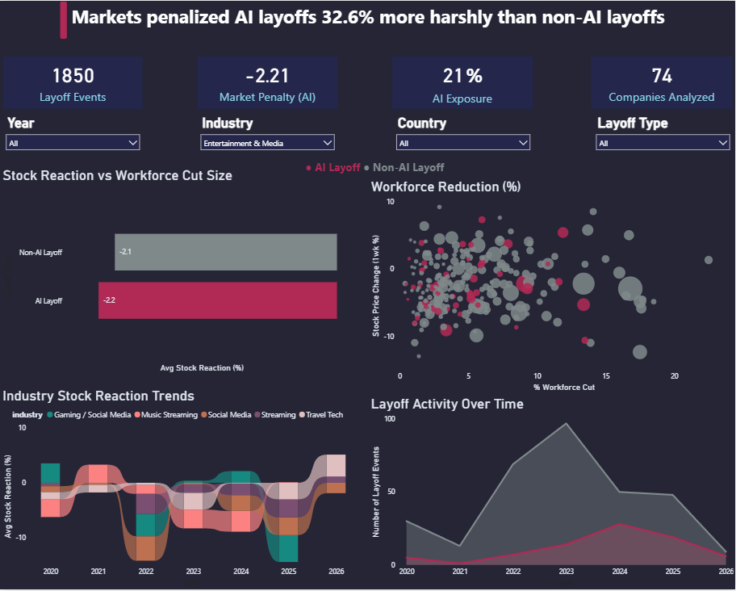
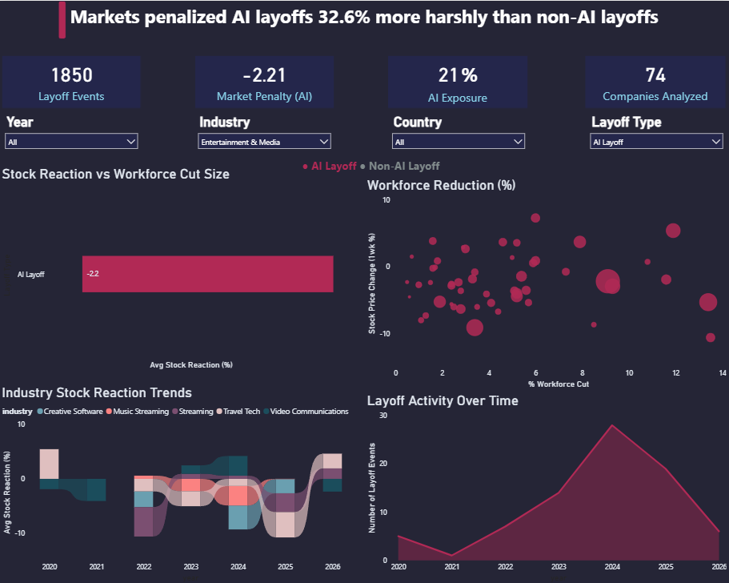
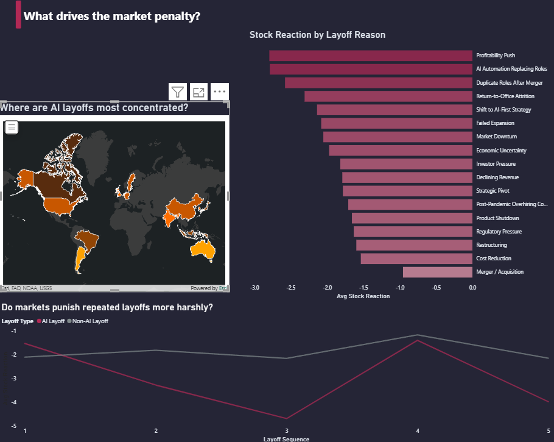
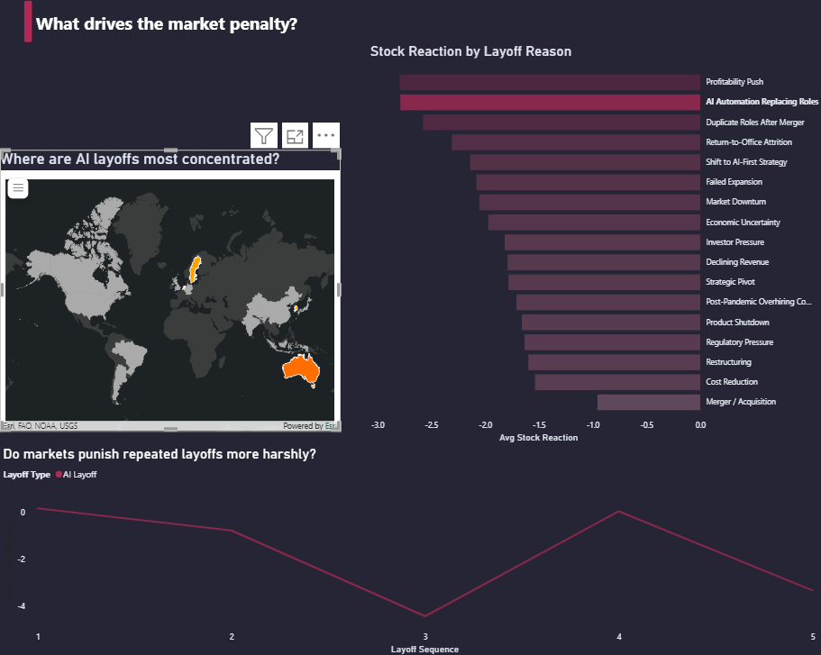

# Markets Penalized AI Layoffs 32.6% More Harshly Than Non-AI Layoffs

**SQL + Power BI | Global AI & Tech Layoffs 2020-2026**

View Proposal | View Report

---

Every time a tech company announces layoffs and credits AI, the narrative is the same: we are becoming leaner, smarter, more competitive. This project tests whether investors actually buy it.

**They don't.**

AI-driven layoffs averaged a -2.48% stock reaction in the week following announcement. Non-AI layoffs averaged -1.87%. The efficiency framing does not just fail to help it makes the market reaction worse.

---

## Dataset

**Source:** [Global AI & Tech Layoffs 2020-2026](https://www.kaggle.com/) on Kaggle

**Coverage:** 1,850 layoff events | 74 companies | 18 countries | 49 industries | 1,389 rows with public stock data

---

## Tools

- **PostgreSQL** for data cleaning, enrichment, and analysis
- **Power BI** for the interactive dashboard (custom 1280x1024 dark navy canvas)

---

## Key Findings

| | Question | Finding |
|--|----------|---------|
| Q1 | Do AI layoffs get better stock reactions? | No. AI layoffs averaged -2.48% vs -1.87% for non-AI |
| Q2 | Which layoff reasons hit hardest? | AI-Driven is the worst category across all 5 reason buckets |
| Q3 | Most severe single events by industry? | ByteDance led at 25.5% workforce cut in a single event |
| Q4 | Do repeat layoffs get punished more? | No. Reactions for sequences 2-14 show no clear worsening trend |
| Q5 | Does cut size change the AI penalty? | Yes. Large AI cuts (20-40%) get nearly 3x harsher reactions than equivalent non-AI cuts |
| Q6 | Which countries have highest AI layoff concentration? | Germany (32.9%), Brazil (30.4%), Netherlands (27.4%) |
| Q7 | Are extreme cuts more likely AI-driven? | No. The deepest cuts are predominantly financial or restructuring-driven |

**The sharpest finding:** Markets tolerate small AI efficiency cuts. They severely punish large-scale AI-driven workforce destruction. The gap between AI and non-AI reactions is modest under 5% workforce cuts and nearly 3x for cuts in the 20-40% range.

**The most counterintuitive finding:** AI layoffs get harsher market reactions but are not the most extreme in scale. Markets appear to penalize the AI narrative more than the actual damage done.

---

## Dashboard

### Page 1: Overview (All Layoffs)
KPI cards, stock reaction comparison by layoff type, scatter plot of reaction vs workforce cut size, and layoff activity from 2020 to 2026 across all 1,850 events.



### Page 1: Filtered to AI Layoffs Only
The same page with the Layoff Type slicer set to AI. Shows how AI layoff events cluster and how the activity wave peaks in 2024.



### Page 2: What Drives the Market Penalty?
Stock reaction broken down by layoff reason, geographic concentration of AI layoffs on a world map, and repeat layoff behavior tracked across sequences.



### Page 2: Cross-Filter in Action
Selecting AI Automation Replacing Roles filters all visuals simultaneously, isolating the relevant companies and reactions across the entire page.



---

## SQL Structure

```
LAYOFFS_PROJECT.sql
├── Section 1: Table Setup
├── Section 2: Data Exploration
├── Section 3: Data Cleaning & Enrichment
│   ├── reason_category (17 reasons bucketed into 5 groups)
│   └── industry_category (49 industries bucketed into 7 sectors)
└── Section 4: Analysis
    ├── Q1: GROUP BY, AVG, CASE WHEN
    ├── Q2: GROUP BY aggregation by reason category
    ├── Q3: DENSE_RANK() OVER (PARTITION BY industry)
    ├── Q4: LAG(), ROW_NUMBER() for repeat layoff sequencing
    ├── Q5: CASE WHEN bucketing by workforce cut size
    ├── Q6: CTEs comparing country vs global averages
    └── Q7: PERCENT_RANK() to identify top 10% severity events
```

---

## Repo Structure

```
layoffs-market-analysis/
├── LAYOFFS_PROJECT.sql
├── layoffs_dashboard.pbix
├── README.md
├── proposal.md
├── report.md
└── screenshots/
    ├── page1_overview.png
    ├── page1_ai_filtered.png
    ├── page2_evidence.png
    └── page2_cross_filter.png
```

---

*Tanya Ojha | MS Analytics, Northeastern University | [LinkedIn](https://linkedin.com/in/tanyaojha2412)*
